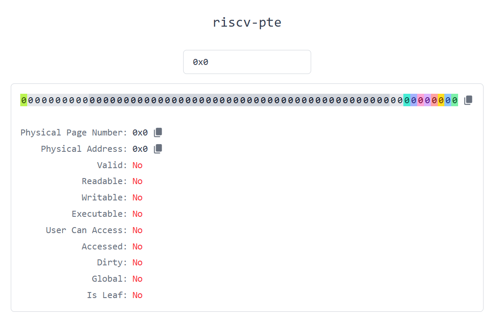

  <b>English 🇺🇸</b> | <a href="README.zh-CN.md">简体中文 🇨🇳</a>

# riscv-pte 🚀

A lightweight visualization tool for RISC-V Sv39 Page Table Entries (PTEs).

[**Live Demo**](https://gianthard-cyh.github.io/riscv-pte/)

## Features ✨

- **Complete Sv39 PTE visualization** — each bit explained in detail
- **Interactive bit toggling** — flip bits and instantly see how the PTE changes 🔄
- **Clipboard support** — copy the entire PTE data with one click 📋
- **Dark mode** — easy on the eyes in any environment 🌙

---

Built for engineers and enthusiasts looking to understand or debug RISC-V paging.
Contributions and feedback are welcome! 🙌
